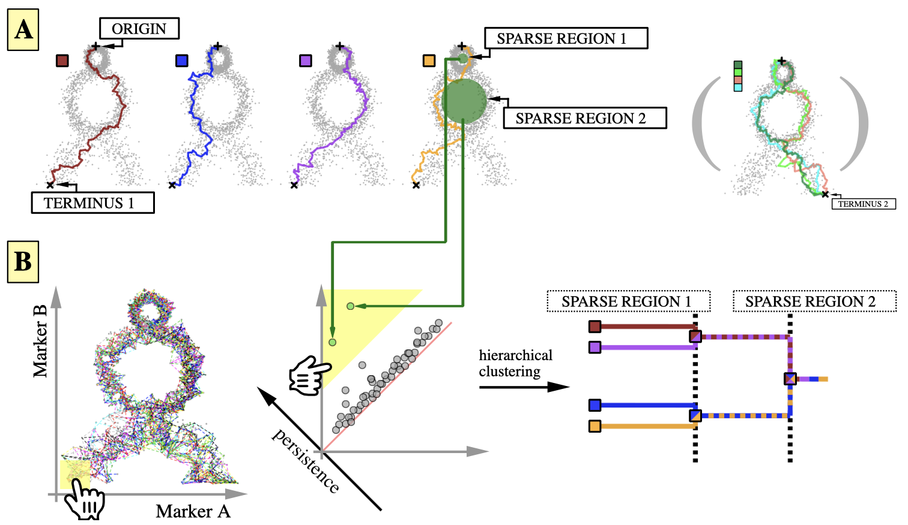
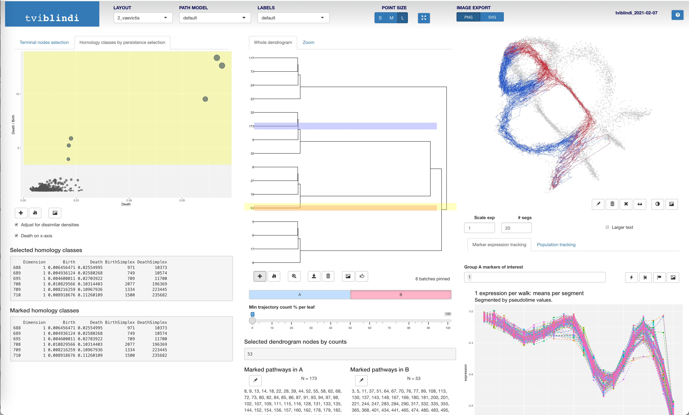
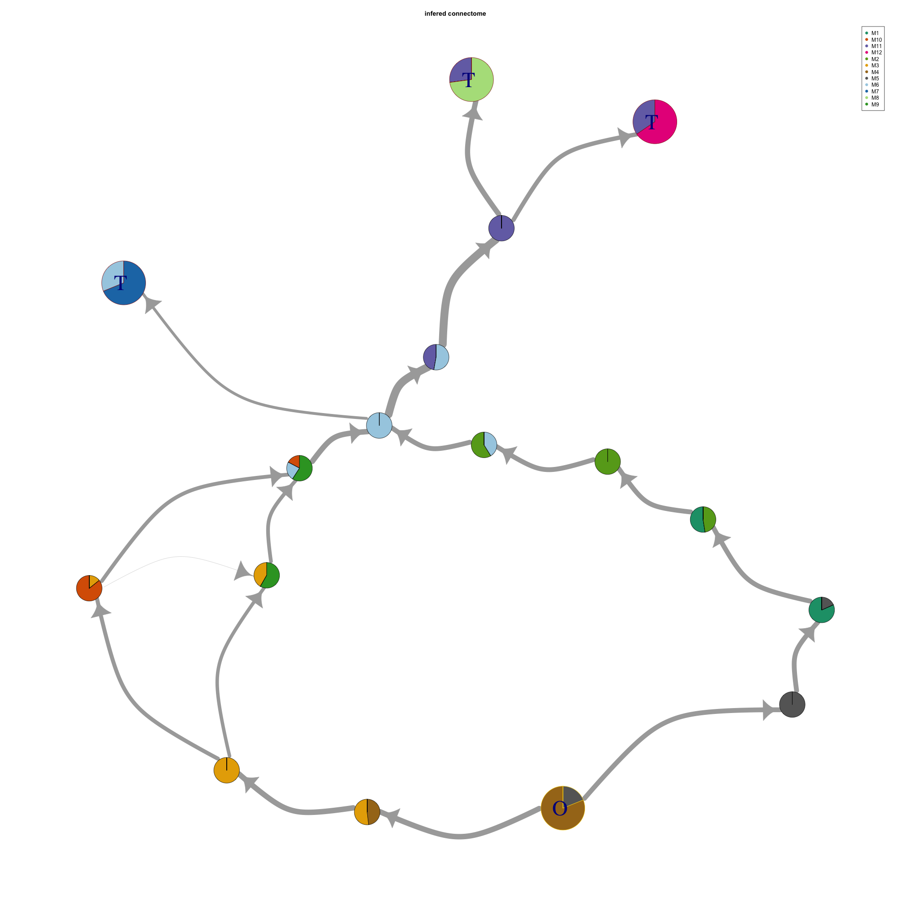

**Topological and Geometrical Tools for Single-Cell Data**

*tviblindi* is a trajectory inference toolkit for single-cell data.

This package is under development and depends on several libraries - issues during installation are expected.

We recommend to pull the Docker container provided with all dependencies and an RStudio server.

- - - - -

Parts of code from following libraries are used:\
[RcppAnnoy](https://cran.r-project.org/web/packages/RcppAnnoy/index.html)\
[Gudhi](https://gudhi.inria.fr)\
[Phat](https://www.sciencedirect.com/science/article/pii/S0747717116300098)\
[CGAL](https://www.cgal.org)

- - - - -

<kbd>
  
</kbd>


`tviblindi` puts concepts from graph theory and algebraic topology to use for trajectory inference (TI) in high-dimensional biological data (cytometry, scRNA-seq, CITE-seq).

We provide easy-to-use tools for identifying potential developmental trajectories and grouping them in a classification tree.
This includes a graphical user interface that enables the user to

* inspect trajectories in different classes by topological relationships,

* view the trajectories drawn on a 2-dimensional layout of input data,

* track progression of expression levels for markers of interest at different stages of development,

* check the composition of tracked populations in terms of labelled cell populations and

* export enhanced FCS files for viewing results of the TI analysis in FlowJo or other gating software.

# Docker container

With Docker installed, run the following code in a Unix terminal.

## Intel / amd64

```
port=7777\
data_path="path to data folder to mount"\
rpassword="password for rstudio server (user=rstudio)"\
docker run -it -d -p $port:8787 --name tviblindi_container -v $data_path:/data -e PASSWORD=$rpassword stuchly/tviblindi
```

## Apple Silicon / arm64

A native `linux/arm64` image is also published as `stuchly/tviblindi:arm64`
(includes RStudio Server and vaevictis):

```
port=7777\
data_path="path to data folder to mount"\
rpassword="password for rstudio server (user=rstudio)"\
docker run -it -d --platform linux/arm64 -p $port:8787 --name tviblindi_container -v $data_path:/home/rstudio/work -e PASSWORD=$rpassword stuchly/tviblindi:arm64
```

Then navigate to `localhost:7777` in your web browser.
Enter the default credentials when prompted (user: `rstudio`, password: `rpassword`).

`localhost` may also depend on your Docker daemon setting.

# Direct installation

Supported on **macOS** and **Linux**. Windows is not supported — the CGAL/GUDHI/PHAT
C++ toolchain this package builds on doesn't build cleanly there.

*tviblindi* depends on the *CGAL* library — no upper version pin, verified
working from CGAL 5.6 through 6.2. GUDHI and PHAT are vendored (no separate
install needed).

## macOS

```
brew install cgal libomp
```

`libomp` is required separately — `tviblindi`'s `configure` script checks for
it explicitly (`brew install libomp` if you ever see a "libomp not found"
error at install time).

## Linux

```
sudo apt install libcgal-dev libboost-dev libeigen3-dev libgmp-dev libmpfr-dev \
  libglpk-dev libwebpmux3 build-essential gfortran cmake
```

`libwebpmux3` isn't a CGAL/tviblindi dependency directly - it's needed for
the R package `ragg` (pulled in transitively via `tidyverse`) to load at
all. Without it, plotting fails with `unable to load shared object
'.../ragg/libs/ragg.so': libwebpmux.so.3: cannot open shared object file`.

One extra step on Debian/Ubuntu: their `libcgal-dev` package ships no
compiled library (header-only by design), so a couple of CGAL symbols
(`CGAL::Random` and similar) need the `CGAL_HEADER_ONLY` preprocessor macro
defined to compile without it:

```
sudo sed -i '15i #define CGAL_HEADER_ONLY 1' /usr/include/CGAL/config.h
```

`docker/linux-test/` in this repo is a working, verified reference for the
whole Linux setup (RStudio Server included) if you'd rather use a container
than replicate these steps by hand.

## Both platforms

If you end up on CGAL 5.x (not 6.x), also pin R's `BH` package to
`1.87.0-1` or older:

```r
install.packages("https://cran.r-project.org/src/contrib/Archive/BH/BH_1.87.0-1.tar.gz", repos=NULL, type="source")
```

Newer `BH` bundles a Boost that dropped `boost::mpl::if_c`, which CGAL 5.x's
headers still need. CGAL 6.x doesn't have this dependency, so skip this step
if you're on 6.x.

To install *tviblindi* in R, run

```
devtools::install_github('stuchly/tviblindi')
```

To be able to use default dimensionality reduction, install *vaevictis*

```
reticulate::py_install("git+https://github.com/stuchly/vaevictis.git",pip=TRUE)
```

# Usage

We include sample code below to run the *tviblindi* pipeline on synthetic data.

```
library(tviblindi)
data(tviblindi_dyntoydata)
group_id<-tviblindi_dyntoydata[,1]
datainput<-as.matrix(tviblindi_dyntoydata[,-1])
tv1<-tviblindi(data=datainput,labels=group_id)
DimRed(tv1)
DimRed(tv1,method="umap")

Set_origin(tv1,label = "M4",origin_name = "M4_hitting_time")
Set_origin(tv1,label = "M4",origin_name = "M4_hitting_distance")
KNN(tv1)
Cluster(tv1,K=225) #kmeans clustering
Filtration(tv1) #default setting is very conservative, less simplices could be
# created with same resolution (e.g. Filtration(tv1,alpha2=1))

Pseudotime(tv1,weighted = FALSE,origin_name = "M4_hitting_time")
Walks(tv1,N=1000,origin_name = "M4_hitting_time")

Pseudotime(tv1,weighted = TRUE,origin_name = "M4_hitting_distance")
Walks(tv1,N=1000,origin_name = "M4_hitting_distance")
launch_shiny(tv1)
```

<kbd>
  
</kbd>

To inspect the connectedness of different populations in your dataset based on Louvain clustering, use the fully automated 'connectome' functionality: produces a PNG file.

```
Connectome(tv1)
```

<center>
<kbd>
  
</kbd>
</center>

# Reference
[Preprint](https://www.biorxiv.org/content/10.1101/2023.07.13.547329v3) describing and validating the method.

See `supplemetary_note.pdf` in vignette for technical background.

The Shiny app (GUI) was developed as part of [David Novak](https://github.com/davnovak)'s master thesis: [Studying lymphocyte development using mass cytometry](https://dspace.cuni.cz/handle/20.500.11956/119793?locale-attribute=en).
