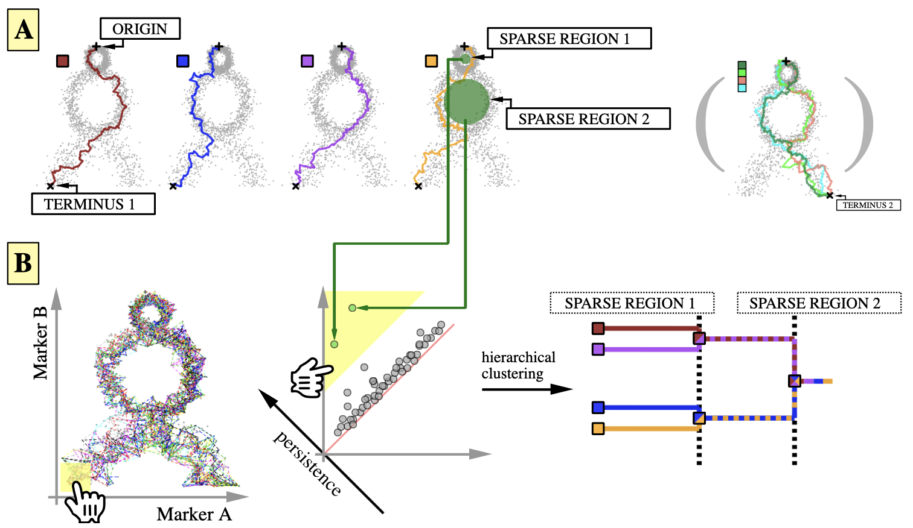

# tviblindi
Topological and Geometrical Tools for Single-cell Data

This package is under development and depends on several libraries - issues during installation are expected.

We recommend to pull the docker container provided with all dependencies and Rstudio server

parts of code from following libraries are used:\
[RcppAnnoy](https://cran.r-project.org/web/packages/RcppAnnoy/index.html)\
[Gudhi](https://gudhi.inria.fr)\
[Phat](https://www.sciencedirect.com/science/article/pii/S0747717116300098)

**Single-cell trajectory inference toolkit**

- - - - -

<kbd>
  
</kbd>

`tviblindi` puts concepts from graph theory and algebraic topology to use for trajectory inference (TI) in high-dimensional biological data (cytometry, scRNA-seq, CITE-seq).

We provide easy-to-use tools for identifying potential developmental trajectories and grouping them in a classification tree.
This includes a graphical user interface that enables the user to

* inspect trajectories in different classes by topological relationships,

* view the trajectories drawn on a 2-dimensional layout of input data,

* track progression of expression levels for markers of interest at different stages of development,

* check the composition of tracked populations in terms of labelled cell populations and

* export enhanced FCS files for viewing results of the TI analysis in FlowJo or other gating software.

# Docker container
Apple silicon (M1) is not supported for the time being

port=7777\
data_path="path to data folder to mount"\
rpassword="password for rstudio server (user=rstudio)"\
docker run -it -d -p $port:8787 --name tviblindi_container -v $data_path:/data -e PASSWORD=$rpassword stuchly/tviblindi

then in your webrowser visit localhost:7777 (user: rstudio, password: rpassword; localhost may depends on your docker daemon setting)

# Installation 
devtools::install_github("stuchly/tviblindi")

Current version of tviblindi depends on CGAL library version 4.14

Macos:

brew tap-new CGAL/legacy   

brew extract --version=4.14 CGAL CGAL/legacy

brew install CGAL/legacy/CGAL@4.14  

# Citation
The article is in process

The shiny app was developed as a part of master's thesis of co-author [David Novak](https://github.com/davnovak):  [Studying lymphocyte development using mass cytometry](https://dspace.cuni.cz/handle/20.500.11956/119793?locale-attribute=en)
